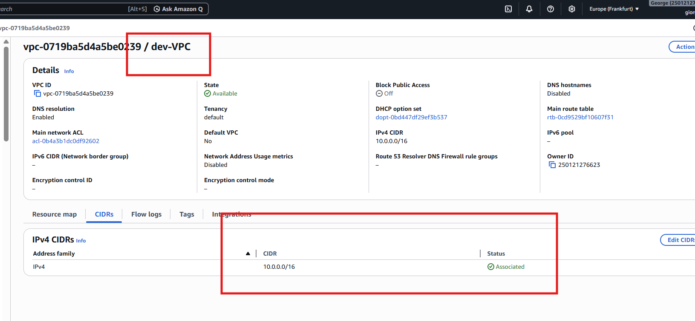
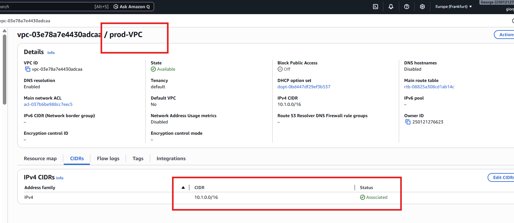
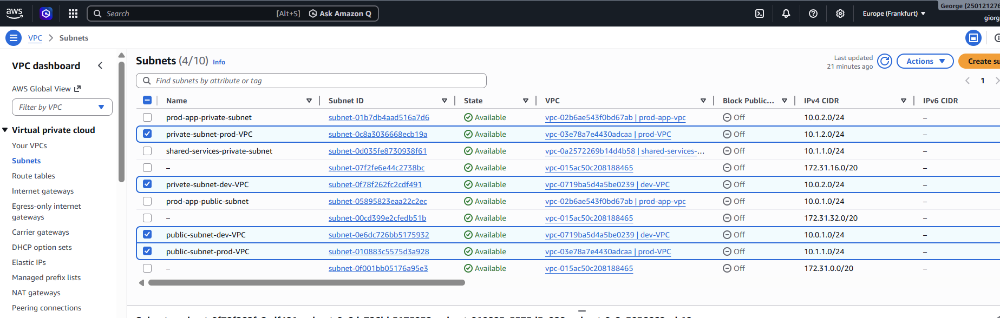
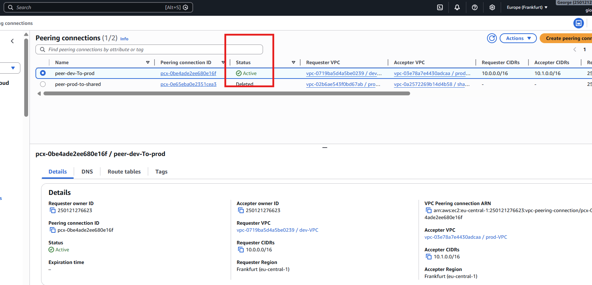
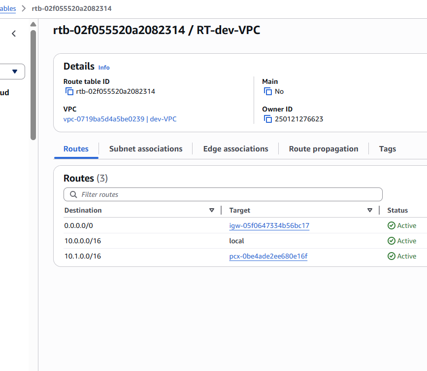
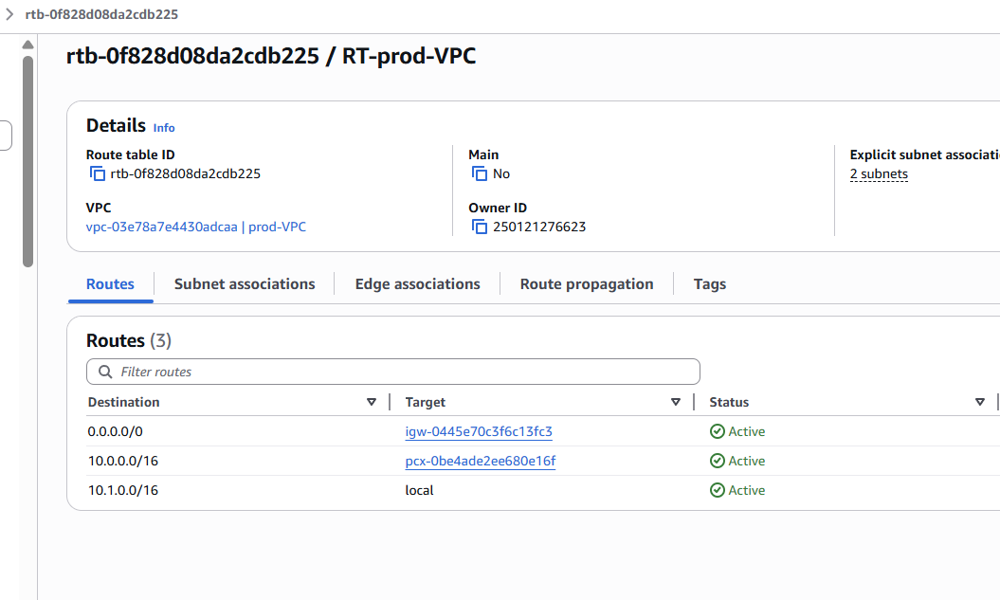
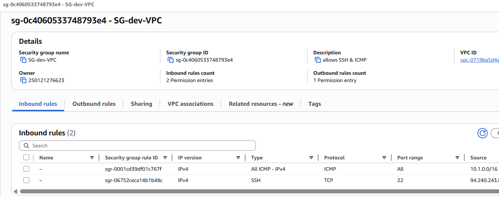
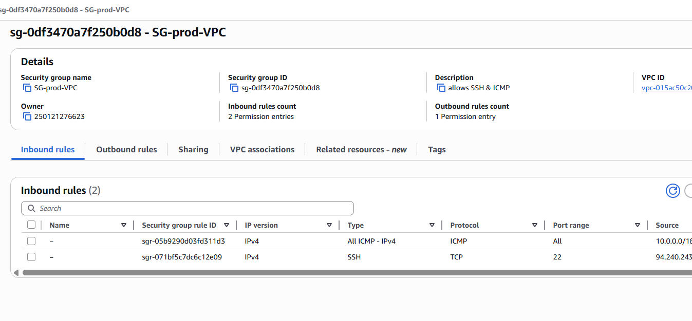
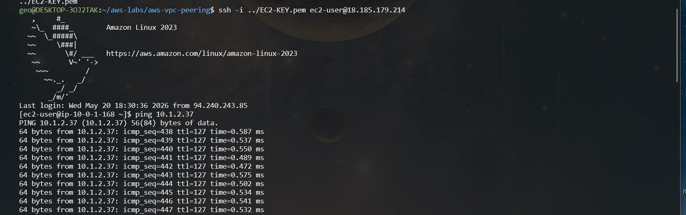

# aws-vpc-peering

## VPC peering dev-VPC და prod-VPC შორის. უკავშირდება EC2 instance-ს private მისამართზე

## VPC peering between two VPCs to enable private communication between EC2 instances

## Architecture
- dev-VPC (10.0.0.0/16)
	- public-subnet-dev-VPC	10.0.1.0/24
	- private-subnet-dev-VPC  10.0.2.0/24
	- securit group - allows SSH & ICMP
- prod-VPC (10.1.0.0/16)
	- public-subnet-prod-VPC 10.1.1.0/24
	- private-subnet-prod-VPC 10.1.2.0/2
	- securit group - allows SSH & ICMP

## Components
- Public and private subnets
- Internet Gateway
- Route Tables
- Security Groups
- VPC Peering Connection

## Connectivity Test
ტესტირება გავუკეთე WSL-დან, ping გავიდა EC2 instance private IP-ზე
verified connectivity using private IP ping between EC2 instances.

## Screenshots

### dev-VPC

### prod-VPC

### Subnets

### VPC Peering

### Route Tables (dev)

### Route Tables (prod)

### Security Groups (dev)

### Security Groups (prod)

### Connectivity Test (Ping)

##  Author
Giorgi Petriashvili
გიორგი პეტრიაშვილი
Giorgi Petriashvili

Network Engineer (NOC Experience)
Building Cloud skills with AWS (VPC, EC2, IAM, S3, CloudWatch)
